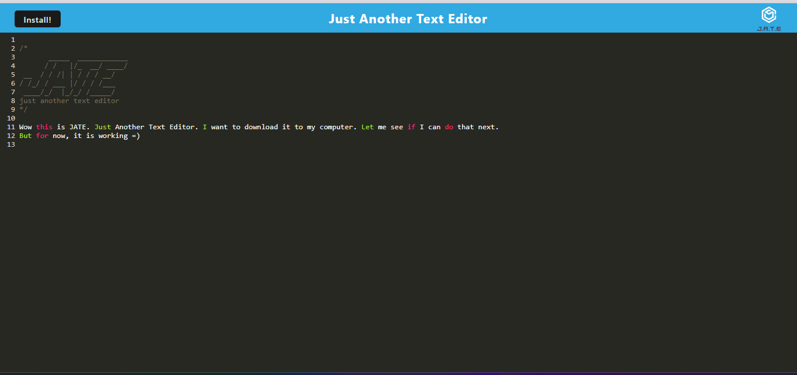
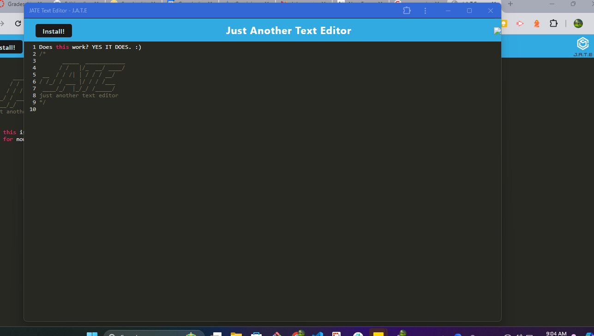

# ProgressiveTextEditor
Just another text editor, but this one is a PWA. Everything works, but I had issues getting Render to deploy. 

## Screenshots

## Technologies Used
  - babel
  - webpack
  - workbox
  - idb
  - express
  - node

  ## Credits

* Copilot

## License

This project is licensed under the MIT license.
